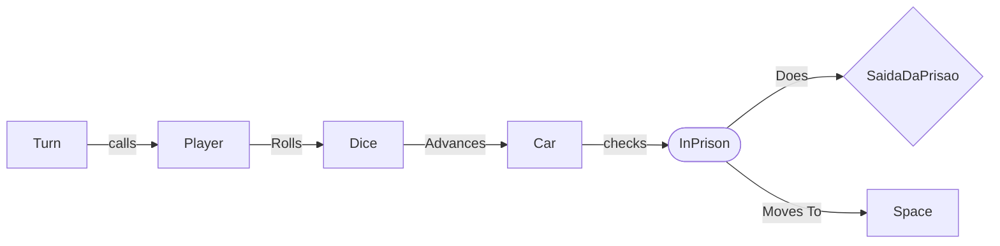
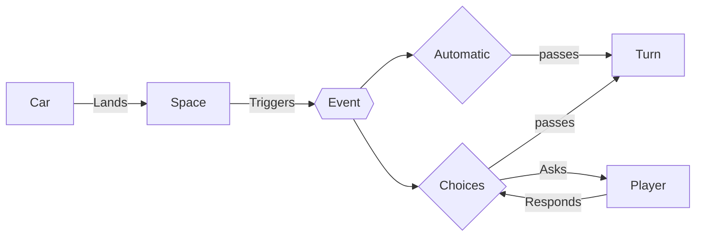
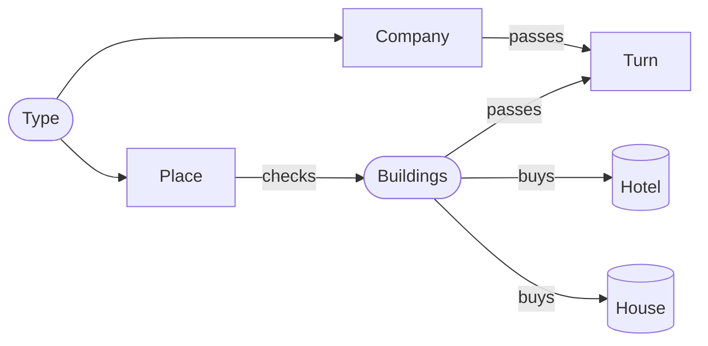
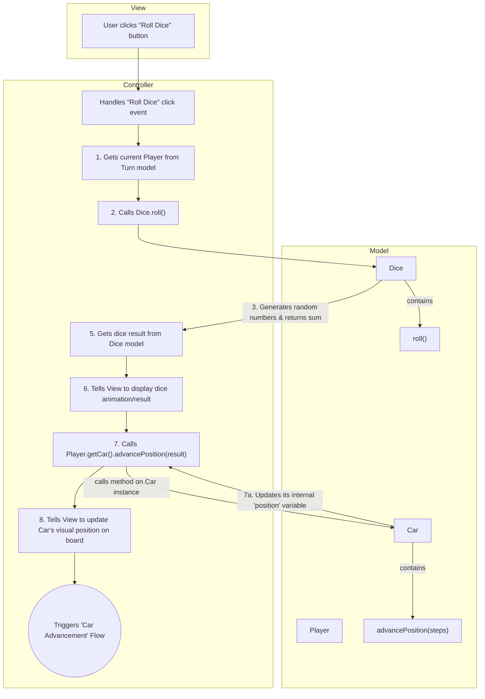
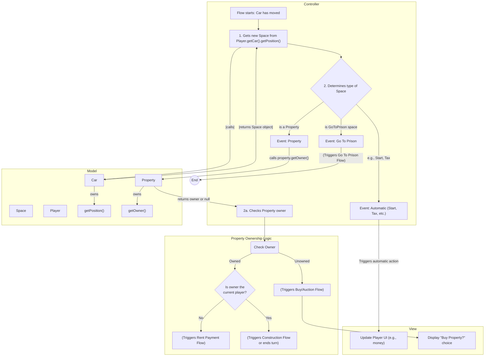
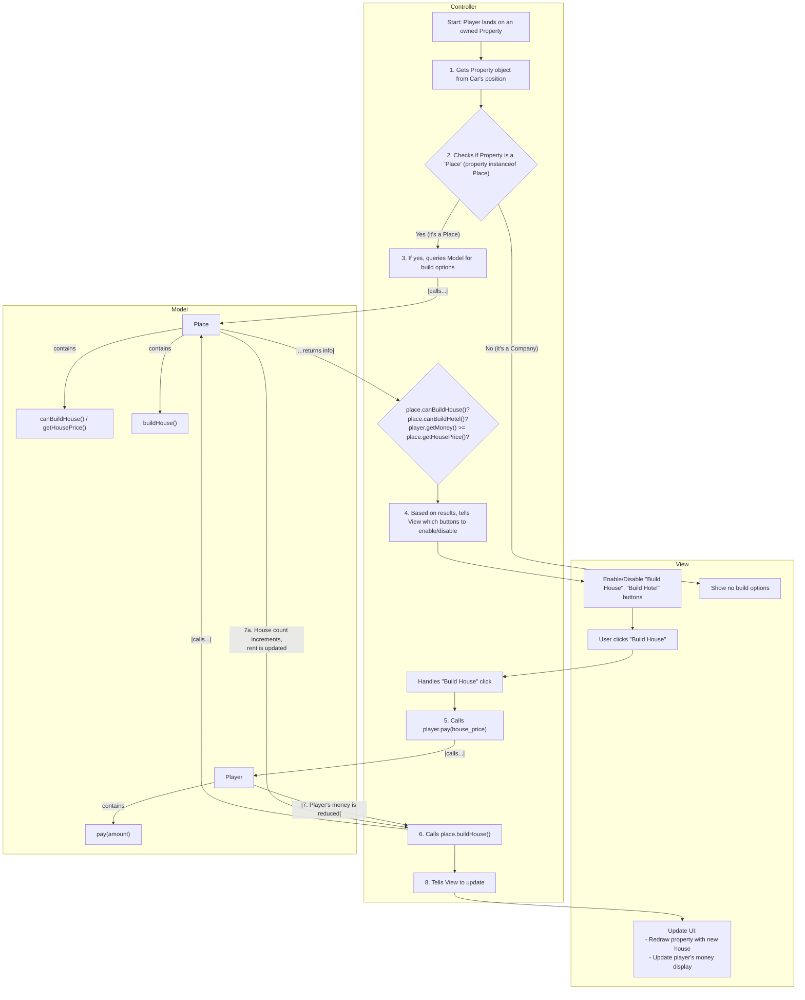

- Rodada de dados e Avanço do Pino - Barella

Falta a parte inicial (Turn calls Player)

Neste fluxo, a ideia é que o Controller chame o método **rollDice** e também o método <b>isInPrison</b>. Se este método retornar true, então o fluxo de **SaidaDaPrisão** e seus métodos próprios devem ser chamados. Se retornar false, o método **advancePosition** é chamado para avançar o Peão (Car).

- Avanço do Carro - Barella

Caso o jogador estivesse fora da prisão, ele andaria X espaços e cairia em um novo espaço. A depender do espaço em que caiu, ele poderá tomar uma decisão ou não. 
Casos em que ele não toma nenhuma decisão:

- Paga aluguel
- GoToPrison
- Paga de um Revés
- Recebe de uma Sorte

É claro que, caso ele não tenha dinheiro, poderá decidir? qual propriedade vender, entrando em um outro fluxo.

- Casas de Escolha (Construção) - Barella

FlowCharts específicos:
Rodada de dados e Avanço do Pino

Avanço do Carro:

Casas de Escolha (Construção):

