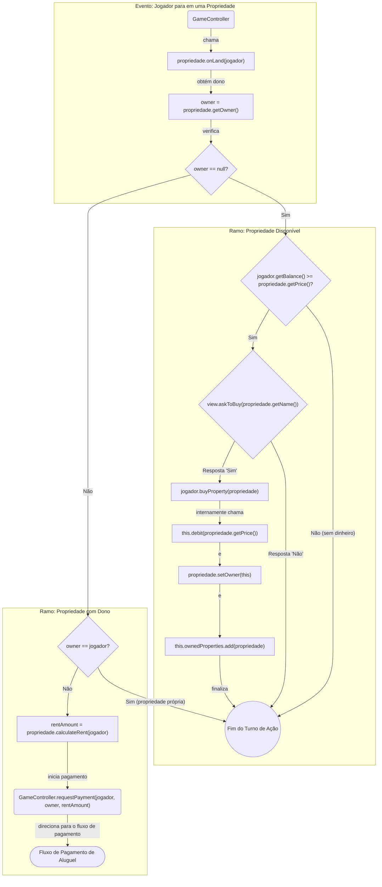
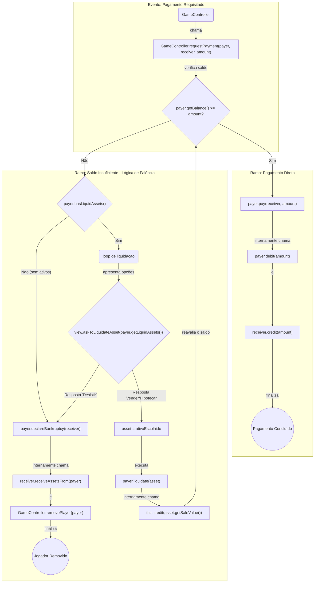

---



---

```java
// Pacote: game.model.core.entities

public class Bank {
    /** O dinheiro total que o banco possui. */
    private double treasury;
    /** Número de casas disponíveis para venda. */
    private int availableHouses;
    /** Número de hotéis disponíveis для venda. */
    private int availableHotels;

    public Bank(double initialTreasury, int totalHouses, int totalHotels) {}
    public void credit(double amount) {}
    public void debit(double amount) {}
    public boolean hasAvailableHouses(int quantity) {}
    public boolean hasAvailableHotels(int quantity) {}
    public void sellHouses(int quantity) {}
    public void sellHotels(int quantity) {}
    public void buyBackHouses(int quantity) {}
    public void buyBackHotels(int quantity) {}
}

public class Board {
    /** Lista de todas as casas do tabuleiro em ordem. */
    private List<Space> spaces;
    /** Mapeia a posição da prisão para acesso rápido. */
    private int prisonPosition;

    public Board(List<Space> spaces) {}
    public Space getSpaceAt(int position) {}
    public int getPrisonPosition() {}
    public int getTotalSpaces() {}
}

public class Car {
    /** A posição atual do peão no tabuleiro (índice na lista de casas). */
    private int currentPosition;
    /** Cor ou identificador do peão. */
    private String color;

    public Car(String color) {}
    public int getCurrentPosition() {}
    public void moveTo(int newPosition) {}
    public void advance(int steps, int boardSize) {}
}

public class Dice {
    private int lastRoll1;
    private int lastRoll2;

    public Dice() {}
    /** Rola os dois dados e armazena os resultados. */
    public void roll() {}
    public int getLastRoll1() {}
    public int getLastRoll2() {}
    /** Retorna a soma dos últimos dois dados rolados. */
    public int getTotal() {}
    /** Verifica se a última rolagem resultou em valores iguais. */
    public boolean wasDouble() {}
}

public class LuckDeck {
    /** A pilha de cartas para serem sorteadas. */
    private Deque<LuckCard> cards;

    public LuckDeck(List<LuckCard> cards) {}
    /** Embaralha as cartas no baralho. */
    public void shuffle() {}
    /** Retira a carta do topo do baralho. */
    public LuckCard drawCard() {}
    /** Coloca uma carta de volta no fundo do baralho (ex: "Saída Livre da Prisão"). */
    public void returnCard(LuckCard card) {}
}

public class Player {
    private final String name;
    private double balance;
    private Car car;
    private List<Property> ownedProperties;
    private List<GetOutPrisonCard> jailCards;
    private boolean isInJail;
    private int turnsInJail;
    private int consecutiveDoubles;

    public Player(String name, String carColor, double initialBalance) {}
    public String getName() {}
    public double getBalance() {}
    public Car getCar() {}
    public boolean isInJail() {}
    public void credit(double amount) {}
    public void debit(double amount) {}
    public void pay(Player receiver, double amount) {}
    public void buyProperty(Property property) {}
    public void goToJail() {}
    public void leaveJail() {}
    public void addGetOutOfJailCard(GetOutPrisonCard card) {}
    public GetOutPrisonCard useGetOutOfJailCard() {}
    public boolean hasGetOutOfJailCard() {}
    public boolean hasLiquidAssets() {}
    public List<Property> getLiquidAssets() {}
    public void liquidate(Property asset) {}
    public void declareBankruptcy(Player creditor) {}
    public void receiveAssetsFrom(Player bankruptPlayer) {}
}

// A classe Turn pode ser parte de um GameController ou uma entidade separada.
public class Turn {
    private Player currentPlayer;
    private Dice dice;
    private int turnState; // Ex: 0=start, 1=rolled, 2=action_done

    public Turn(Player currentPlayer) {}
    public void execute() {}
}

// --- Pacote: game.model.core.entities.cards ---

public abstract class LuckCard {
    protected String description;

    public LuckCard(String description) {}
    public String getDescription() {}
    /** Executa a ação da carta sobre o jogador e o estado do jogo. */
    public abstract void execute(Player player, GameController gameController);
}

public class GetOutPrisonCard extends LuckCard {
    public GetOutPrisonCard(String description) { super(description); }
    @Override
    public void execute(Player player, GameController gameController) {}
}

public class GoToPrisonCard extends LuckCard {
    public GoToPrisonCard(String description) { super(description); }
    @Override
    public void execute(Player player, GameController gameController) {}
}

public class PayCard extends LuckCard {
    private double amountToPay;

    public PayCard(String description, double amount) { super(description); }
    @Override
    public void execute(Player player, GameController gameController) {}
}

public class ReceiveCard extends LuckCard {
    private double amountToReceive;

    public ReceiveCard(String description, double amount) { super(description); }
    @Override
    public void execute(Player player, GameController gameController) {}
}

public class ReceiveFromOthersCard extends LuckCard {
    private double amountPerPlayer;

    public ReceiveFromOthersCard(String description, double amount) { super(description); }
    @Override
    public void execute(Player player, GameController gameController) {}
}


// --- Pacote: game.model.core.entities.spaces ---

public abstract class Space {
    protected final String name;

    public Space(String name) {}
    public String getName() {}
    /** Método chamado quando um jogador para nesta casa. */
    public abstract void onLand(Player player, GameController gameController);
}

public abstract class Property extends Space {
    protected final double price;
    protected Player owner;

    public Property(String name, double price) { super(name); }
    public double getPrice() {}
    public Player getOwner() {}
    public void setOwner(Player owner) {}
    public boolean isOwned() {}
    /** Calcula o valor do aluguel. Pode depender de dados para Companhias. */
    public abstract double calculateRent(Player player);
    @Override
    public void onLand(Player player, GameController gameController) {}
}

public class Company extends Property {
    public Company(String name, double price) { super(name, price); }
    @Override
    public double calculateRent(Player player) {
        // A lógica real precisaria do resultado dos dados
        return 0.0;
    }
}

public class Place extends Property {
    private final double baseRent;
    private final double houseCost;
    private int houseCount; // 0-4 casas, 5 representa um hotel
    private final double[] rentByHouseCount; // Array de 6 posições (0 casas a 1 hotel)

    public Place(String name, double price, double houseCost, double[] rents) { super(name, price); }
    public int getHouseCount() {}
    public boolean hasHotel() {}
    public void buildHouse() {}
    public void sellHouse() {}
    @Override
    public double calculateRent(Player player) {
        // Lógica para calcular o aluguel baseado em houseCount
        return 0.0;
    }
}

// Representa uma construção (Casa ou Hotel)
public abstract class Building {
    protected final double cost;
    public Building(double cost) { this.cost = cost; }
    public double getCost() { return cost; }
}

public class House extends Building {
    public House(double cost) { super(cost); }
}

public class Hotel extends Building {
    public Hotel(double cost) { super(cost); }
}


// --- Casas Especiais ---

public class GoToPrison extends Space {
    public GoToPrison(String name) { super(name); }
    @Override
    public void onLand(Player player, GameController gameController) {}
}

public class Prison extends Space {
    public Prison(String name) { super(name); }
    /** Este onLand é para "visitas". A lógica de estar preso é controlada pelo Player. */
    @Override
    public void onLand(Player player, GameController gameController) {}
}

public class Start extends Space {
    private final double salary;

    public Start(String name, double salary) { super(name); }
    @Override
    public void onLand(Player player, GameController gameController) {}
    public double getSalary() { return salary; }
}

// Nota: As classes Chance, Tax, e Profit do diagrama inicial podem ser implementadas
// de forma similar às outras subclasses de Space, ou suas lógicas podem ser
// encapsuladas dentro das cartas de Sorte/Cofre. A estrutura acima é flexível
// para ambas as abordagens.
```

v2:
```java
// =======================================================================
// ENUMS E TIPOS AUXILIARES
// =======================================================================

/**
 * Define o tipo de uma construção em uma propriedade.
 */
private enum Building {
    HOUSE,
    HOTEL
}

/**
 * Define o tipo de uma carta de Sorte ou Revés.
 */
private enum LuckType {
    FORTUNE,  // Sorte
    MISFORTUNE // Revés
}

/**
 * Define as fases possíveis de um turno de jogador.
 */
private enum TurnPhase {
    PRE_ROLL,      // Antes de rolar os dados
    POST_ROLL,     // Depois de rolar, antes de executar a ação da casa
    ACTION_PHASE,  // Durante a interação com a casa (compra, pagamento)
    TURN_ENDED     // Turno finalizado
}

// =======================================================================
// PACOTE: game.model.core.entities
// =======================================================================

public class Bank {
    /** O dinheiro total que o banco possui. */
    private double treasury;
    /** Lista de propriedades que ainda não foram compradas por nenhum jogador. */
    private List<Property> unownedProperties;

    public Bank(double initialTreasury, List<Property> allProperties) {}

    public void credit(double amount) {}
    public void debit(double amount) {}
    public List<Property> getUnownedProperties() {}
    /** Chamado quando um jogador compra uma propriedade. */
    public void markPropertyAsOwned(Property property) {}
}

public class Board {
    /** Lista de todas as casas do tabuleiro em ordem. */
    private final List<Space> spaces;
    private final int prisonPosition;

    public Board(List<Space> spaces, int prisonPosition) {}

    public Space getSpaceAt(int position) {}
    public int getPrisonPosition() {}
    public int getTotalSpaces() {}
}

public class Car {
    /** A posição atual do peão no tabuleiro (índice na lista de casas). */
    private int currentPosition;
    /** Cor ou identificador único do peão. */
    private final String color;

    public Car(String color) {}

    public int getCurrentPosition() {}
    public void moveTo(int newPosition) {}
    /** Avança o peão, tratando o loop do tabuleiro. */
    public void advance(int steps, int boardSize) {}
}

public class Dice {
    private int lastRoll1;
    private int lastRoll2;

    public Dice() {}

    /** Rola os dois dados e armazena os resultados. */
    public void roll() {}
    public int getLastRoll1() {}
    public int getLastRoll2() {}
    public int getTotal() {}
    public boolean wasDouble() {}
}

public class LuckDeck {
    /** A pilha de cartas para serem sorteadas. */
    private Deque<LuckCard> cards;

    public LuckDeck(List<LuckCard> cards) {}

    public void shuffle() {}
    public LuckCard drawCard() {}
    public void returnCard(LuckCard card) {}
}

public class Player {
    private final String name;
    private double balance;
    private final Car car;
    private final List<Property> ownedProperties;
    private final List<GetOutPrisonCard> jailCards;
    private boolean isInJail;
    private int turnsInJail;
    private int consecutiveDoubles;

    public Player(String name, String carColor, double initialBalance) {}

    public String getName() {}
    public double getBalance() {}
    public Car getCar() {}
    public boolean isInJail() {}
    public int getTurnsInJail() {}

    public void credit(double amount) {}
    public void debit(double amount) {}
    public void pay(Player receiver, double amount) {}

    public void buyProperty(Property property) {}
    public void sellProperty(Property property) {}

    public void goToJail() {}
    public void leaveJail() {}
    public void incrementTurnsInJail() {}

    public void addGetOutOfJailCard(GetOutPrisonCard card) {}
    public GetOutPrisonCard useGetOutOfJailCard() {}
    public boolean hasGetOutOfJailCard() {}

    public boolean hasLiquidAssets() {}
    public List<Property> getLiquidAssets() {}
    public void liquidate(Property asset) {}
    public void declareBankruptcy(Player creditor) {}
    public void receiveAssetsFrom(Player bankruptPlayer) {}
}

public class Turn {
    private final List<Player> playerOrder;
    private int currentPlayerIndex;
    private TurnPhase currentPhase;

    public Turn(List<Player> players) {}

    public Player getCurrentPlayer() {}
    /** Avança para o próximo jogador na ordem. */
    public void advanceToNextPlayer() {}

    public TurnPhase getCurrentPhase() {}
    public void setPhase(TurnPhase newPhase) {}
}

// =======================================================================
// PACOTE: game.model.core.entities.cards
// =======================================================================

public abstract class LuckCard {
    protected final String description;
    protected final LuckType luckType;

    public LuckCard(String description, LuckType type) {}

    public String getDescription() {}
    public LuckType getLuckType() {}
    /** Executa a ação da carta. Precisa de acesso a outras partes do modelo. */
    public abstract void execute(Player currentPlayer, Turn turn, Bank bank);
}

public class GetOutPrisonCard extends LuckCard {
    public GetOutPrisonCard(String description) { super(description, LuckType.FORTUNE); }
    @Override
    public void execute(Player currentPlayer, Turn turn, Bank bank) {}
}

public class GoToPrisonCard extends LuckCard {
    public GoToPrisonCard(String description) { super(description, LuckType.MISFORTUNE); }
    @Override
    public void execute(Player currentPlayer, Turn turn, Bank bank) {}
}
// ... Outras classes de carta seguem o mesmo padrão ...

// =======================================================================
// PACOTE: game.model.core.entities.spaces
// =======================================================================

public abstract class Space {
    protected final String name;

    public Space(String name) {}
    public String getName() {}

    /** Método chamado quando um jogador para nesta casa. */
    public abstract void event(Player player);
}

public abstract class Property extends Space {
    protected final double price;
    protected Player owner;

    public Property(String name, double price) { super(name); }

    public double getPrice() {}
    public Player getOwner() {}
    public void setOwner(Player owner) {}
    public boolean isOwned() {}
    public abstract double calculateRent(Dice dice);

    @Override
    public void event(Player player) {}
}

public class Company extends Property {
    public Company(String name, double price) { super(name, price); }
    @Override
    public double calculateRent(Dice dice) { return 0.0; }
}

public class Place extends Property {
    private final PlaceGroup group;
    private final double baseRent;
    private final double housePrice;
    private final double hotelPrice;
    private final double hotelRentBonus;
    private final Map<Integer, Double> houseRentMap; // <num_casas, valor_aluguel>
    private final Map<Building, Integer> buildings;
    private double currentRent;

    public Place(String name, double price, PlaceGroup group, /*...outros params...*/ Map<Integer, Double> houseRentMap) {
        super(name, price);
        // inicializar todos os campos
    }

    public PlaceGroup getGroup() {}
    public int getHouseCount() {}
    public boolean hasHotel() {}

    /** Tenta construir uma casa, retornando sucesso/falha. */
    public boolean buildHouse() {}
    /** Tenta construir um hotel, retornando sucesso/falha. */
    public boolean buildHotel() {}
    
    /** Atualiza o valor do aluguel corrente com base nas construções. */
    private void updateRent() {}

    @Override
    public double calculateRent(Dice dice) { return this.currentRent; }
}

public class GoToPrison extends Space {
    public GoToPrison(String name) { super(name); }
    @Override
    public void event(Player player) {}
}

public class Prison extends Space {
    public Prison(String name) { super(name); }
    @Override
    public void event(Player player) { /* Apenas visita, nenhuma ação. */ }
}

public class Start extends Space {
    private final double salary;

    public Start(String name, double salary) { super(name); }
    @Override
    public void event(Player player) {}
    public double getSalary() { return salary; }
}

```

v3:

```java
// =======================================================================
// ENUMS E TIPOS AUXILIARES
// =======================================================================

/**
 * Define o tipo de uma construção em uma propriedade do tipo Place.
 */
private enum Building {
    HOUSE,
    HOTEL
}

/**
 * Define o tipo de uma carta de Sorte ou Revés.
 */
private enum LuckType {
    FORTUNE,  // Sorte
    MISFORTUNE // Revés
}

/**
 * Define as fases possíveis de um turno de jogador.
 */
private enum TurnState {
    PRE_ROLL,      // Antes de rolar os dados
    POST_ROLL,     // Depois de rolar, antes de executar a ação da casa
    ACTION_PHASE,  // Durante a interação com a casa (compra, pagamento)
    TURN_ENDED     // Turno finalizado
}

// =======================================================================
// PACOTE: game.model.core.entities
// =======================================================================

public class Bank {
    /** O dinheiro total que o banco possui. */
    private int treasury;
    /** Lista de propriedades que ainda não foram compradas por nenhum jogador. */
    private final List<Property> unownedProperties;

    public Bank(int initialTreasury, List<Property> allProperties) {}

    public void credit(int amount) {}
    public void debit(int amount) {}
    
    /** Verifica se uma propriedade específica pertence ao banco (não tem dono). */
    public boolean isPropertyUnowned(Property property) {}
    
    /** Remove uma propriedade da lista de não possuídas (quando um jogador compra). */
    public void markPropertyAsOwned(Property property) {}
    
    /** Adiciona uma propriedade de volta à lista de não possuídas (ex: falência para o banco). */
    public void returnPropertyToBank(Property property) {}
}

public class Board {
    /** Lista de todas as casas do tabuleiro em ordem. */
    private final List<Space> spaces;
    private final int prisonPosition;

    public Board(List<Space> spaces, int prisonPosition) {}

    public Space getSpaceAt(int position) {}
    public int getPrisonPosition() {}
    public int getTotalSpaces() {}
}

public class Car {
    private int currentPosition;
    private final String color;

    public Car(String color) {}

    public int getCurrentPosition() {}
    public void moveTo(int newPosition) {}
    public void advance(int steps, int boardSize) {}
}

public class Dice {
    private int lastRoll1;
    private int lastRoll2;

    public Dice() {}

    public void roll() {}
    public int getLastRoll1() {}
    public int getLastRoll2() {}
    public int getTotal() {}
    public boolean wasDouble() {}
}

public class LuckDeck {
    private Deque<LuckCard> cards;

    public LuckDeck(List<LuckCard> cards) {}

    public void shuffle() {}
    public LuckCard drawCard() {}
    public void returnCard(LuckCard card) {}
}

public class Player {
    private final String name;
    private int balance;
    private final Car car;
    private final List<Property> ownedProperties;
    private final List<GetOutPrisonCard> jailCards;
    private boolean isInJail;
    private int turnsInJail;

    public Player(String name, String carColor, int initialBalance) {}

    public String getName() {}
    public int getBalance() {}
    public Car getCar() {}
    public boolean isInJail() {}

    public void credit(int amount) {}
    public void debit(int amount) {}
    public void pay(Player receiver, int amount) {}

    public void buyProperty(Property property) {}
    public void sellProperty(Property property) {}

    public void goToJail() {}
    public void leaveJail() {}
    public void incrementTurnsInJail() {}
    
    public void addGetOutOfJailCard(GetOutPrisonCard card) {}
    public GetOutPrisonCard useGetOutOfJailCard() {}
    public boolean hasGetOutOfJailCard() {}
}

public class Turn {
    private final List<Player> playerOrder;
    private int currentPlayerIndex;
    private TurnState currentState;

    public Turn(List<Player> players) {}

    public Player getCurrentPlayer() {}
    public void advanceToNextPlayer() {}

    public TurnState getCurrentState() {}
    public void setState(TurnState newState) {}
}

// =======================================================================
// PACOTE: game.model.core.entities.cards
// =======================================================================

public abstract class LuckCard {
    protected final String description;
    protected final LuckType luckType;

    public LuckCard(String description, LuckType type) {}

    public String getDescription() {}
    public LuckType getLuckType() {}
    public abstract void execute(Player currentPlayer, Turn turn, Bank bank, List<Player> allPlayers);
}
// ... As subclasses de LuckCard (GoToPrisonCard, PayCard, etc.) permanecem as mesmas ...

// =======================================================================
// PACOTE: game.model.core.entities.spaces
// =======================================================================

public abstract class Space {
    protected final String name;

    public Space(String name) {}
    public String getName() {}
    public abstract void event(Player player);
}

public abstract class Property extends Space {
    protected final int price;
    protected Player owner;
    protected int currentRent;

    public Property(String name, int price) { super(name); }

    public int getPrice() {}
    public Player getOwner() {}
    public void setOwner(Player owner) {}
    public boolean isOwned() {}
    
    /** Retorna o valor do aluguel atualmente aplicável para esta propriedade. */
    public int getCurrentRent() {
        return this.currentRent;
    }

    @Override
    public void event(Player player) {}
}

public class Company extends Property {
    public Company(String name, int price) { super(name, price); }
    
    /** * Para Companhias, o aluguel é dinâmico. Este método atualiza e define
     * o `currentRent` baseado no resultado dos dados e em quantas companhias
     * o dono possui, antes de ser cobrado.
     */
    public void updateRent(Dice dice, int ownedCompanyCount) {
        // Ex: if (ownedCompanyCount == 1) this.currentRent = 4 * dice.getTotal();
        // Ex: if (ownedCompanyCount == 2) this.currentRent = 10 * dice.getTotal();
    }
}

public class Place extends Property {
    private final PlaceGroup group;
    private final int housePrice;
    private final int hotelPrice;
    private final int hotelRentBonus;
    private final Map<Integer, Integer> houseRentMap; // <num_casas, valor_aluguel_total>
    private final Map<Building, Integer> buildings;

    public Place(String name, int price, PlaceGroup group, /*...outros params...*/ Map<Integer, Integer> houseRentMap) {
        super(name, price);
        this.buildings = new HashMap<>();
        this.buildings.put(Building.HOUSE, 0);
        this.buildings.put(Building.HOTEL, 0);
        // inicializar outros campos...
        updateCurrentRent(); // Define o aluguel base inicial
    }

    public int getHouseCount() { return this.buildings.get(Building.HOUSE); }
    public boolean hasHotel() { return this.buildings.get(Building.HOTEL) > 0; }
    public boolean buildHouse() { /* Lógica para adicionar casa e chamar updateCurrentRent() */ return true; }
    public boolean buildHotel() { /* Lógica para adicionar hotel e chamar updateCurrentRent() */ return true; }
    
    /** * Atualiza o valor do aluguel corrente com base na quantidade de casas/hotel.
     * Este método é chamado internamente sempre que uma construção é feita/vendida.
     */
    private void updateCurrentRent() {
        int rent = 0;
        if (hasHotel()) {
            // Lógica para aluguel com hotel
            rent = houseRentMap.get(4) + hotelRentBonus; 
        } else {
            rent = houseRentMap.get(getHouseCount());
        }
        this.currentRent = rent;
    }
}

public class GoToPrison extends Space {
    public GoToPrison(String name) { super(name); }
    @Override
    public void event(Player player) {}
}

public class Prison extends Space {
    public Prison(String name) { super(name); }
    @Override
    public void event(Player player) { /* Apenas visita */ }
}

public class Start extends Space {
    private final int salary;

    public Start(String name, int salary) { super(name); }
    @Override
    public void event(Player player) {}
    public int getSalary() { return salary; }
}

```