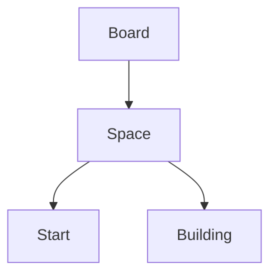

# INF1636 - Programação Orientada a Objetos - Banco Imobiliário

Este repositório guarda o código do trabalho de POO sobre o tema Banco Imobiliário
feito pelo grupo de integrantes:
 - 2310822 - Eduardo Eugênio de Souza
 - 2310540 - Pedro Carneiro Nogueira
 - 2311203 - Pedro Nogueira Barella

## Diagrama de Classes para o trabalho

