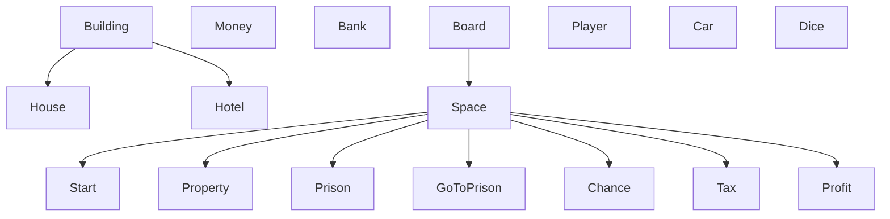
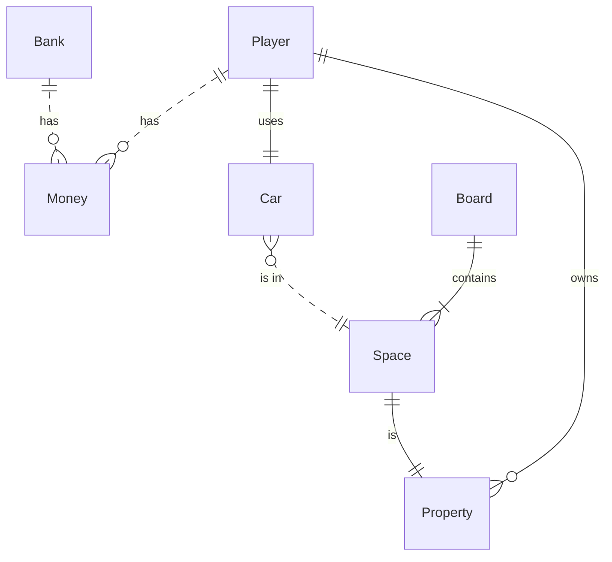

# INF1636 - Programação Orientada a Objetos - Banco Imobiliário

Este repositório guarda o código do trabalho de POO sobre o tema Banco Imobiliário
feito pelo grupo de integrantes:
 - 2310822 - Eduardo Eugênio de Souza
 - 2310540 - Pedro Carneiro Nogueira
 - 2311203 - Pedro Nogueira Barella

## Funcionalidades necessárias para o programa
- Permitir até 6 jogadores
- Lançamento de dados
- distribuir cartas
- movimentar peões no tabuleiro
- decidir o vencedor

## Diagrama de Classes para o trabalho

## Modelagem de Classes
Leia sobre a interpretação do diagrama aqui: [mermaid ER diagrams](https://mermaid.js.org/syntax/entityRelationshipDiagram.html)
